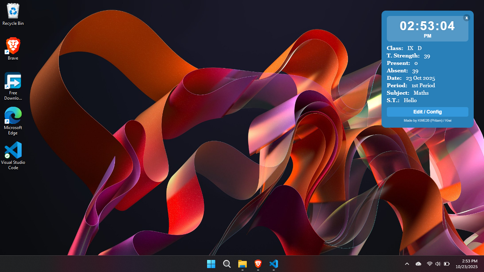
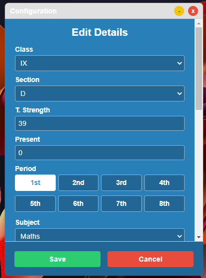

# 🏫 SchoolView


> A lightweight, cross-platform desktop app built with **Electron@12** and **Bun**, designed to run smoothly even on older school computers.

---

## 📦 Prerequisites

Before you begin, make sure you have the following installed:

- [**Bun**](https://bun.sh) (latest stable version)
- A **Windows** or **Linux** compatible machine

---

## ⚙️ System Requirements

| Platform | Minimum Version | Architecture | RAM | Recommended |
|-----------|----------------|---------------|------|--------------|
| 🪟 Windows | 7 or later | x86 / x64 | 1 GB | 1.5 GB+ |
| 🐧 Linux | Ubuntu 16.04 LTS or later | x86 / x64 | 1 GB | 1.5 GB+ |

---

## 🚀 Installation & Usage

### 1. Install dependencies
```bash
bun install
````

### 2. Run the app

```bash
bun start
```

---

## 🏗️ Build Instructions

### 🪟 Build for Windows (Win32 / Win64)

```bash
bun run build:win
```

### 🐧 Build for Linux (AppImage)

```bash
bun run build:linux
```

---

## ❓ FAQ

### 1. Why Electron @ 12?

> Many school computers use outdated hardware and operating systems.
> Electron 12 ensures compatibility with these older environments.

### 2. Why did you make this?

> Because… why not? 😄

---

### 📸 Screenshots

| Screenshot A                        | Screenshot B                        |
| ----------------------------------- | ----------------------------------- |
|  |  |

---

## 📘 License

This project is distributed under no license, use it however you can

---

**Made with ❤️ using Bun & Electron@12**